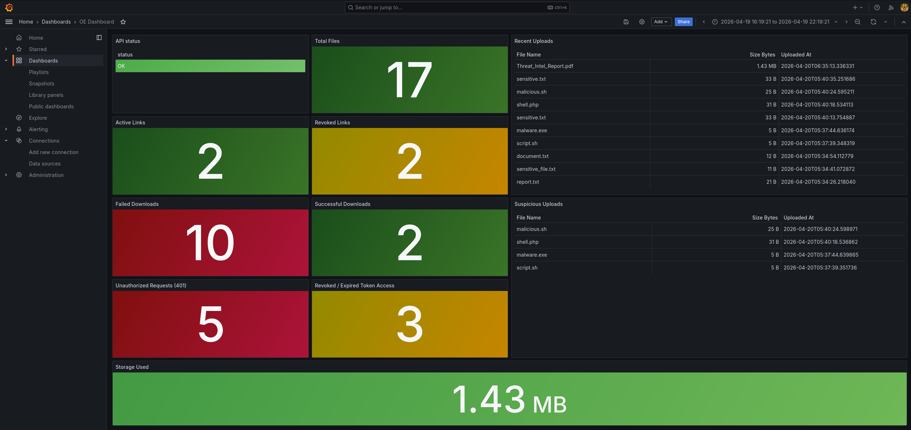

# OE Dashboard: Secure File Exchange Portal

**Version:** 1.0  
**Monitoring Tool:** Grafana  
**Data Source:** SQLite

---

## 1. Overview

This document describes the Operational Excellence Dashboard for the Secure File Exchange Portal. The dashboard provides real-time visibility into system health, security events, link lifecycle, and storage capacity.

---

## 2. Dashboard Architecture

```
[ FastAPI app: main.py ]
         │
         │  Every audit event written to both:
         │  1. stdout (docker logs)
         │  2. SQLite audit_log table
         ▼
[ SQLite: portal.db ]
   ├── files table         ← upload metadata
   ├── links table         ← token lifecycle
   └── audit_log table     ← all security events
         │
         │  frser-sqlite-datasource plugin
         ▼
[ Grafana :3000 ]
   └── OE Dashboard
```
---

## 3. Key Telemetry Metrics

### 3.1 System Health

| Panel | Type | Query | Normal State |
|-------|------|-------|-------------|
| API Status | Table | `SELECT 'OK' as status` | Green "OK" |
| Total Files | Stat | `SELECT COUNT(*) as total_files FROM files` | Any positive number |

---

### 3.2 Security and Threat Detection

| Panel | Type | Threat Ref | Query | Alert Threshold |
|-------|------|-----------|-------|----------------|
| Failed Downloads | Stat | T-1 (IDOR) | `SELECT COUNT(*) as failed FROM audit_log WHERE event='failed_download'` | Red: 10+ |
| Unauthorized Requests (401) | Stat | T-2 (Spoofing) | `SELECT COUNT(*) as unauthorized FROM audit_log WHERE event='unauthorized_request'` | Red: 5+ |
| Revoked / Expired Token Access | Stat | T-1 (IDOR) | `SELECT COUNT(*) as suspicious FROM audit_log WHERE event IN ('revoked_link_access','expired_link_access')` | Yellow: 1+<br>Red: 3+ |
| Suspicious Uploads | Table | T-3 (Tampering) | `SELECT filename, size_bytes, ts FROM audit_log WHERE event='upload_created' AND (detail LIKE '%.php%' OR detail LIKE '%.sh%' OR detail LIKE '%.exe%') ORDER BY ts DESC` | Any row |
| Successful Downloads | Stat | T-1 (IDOR) | `SELECT COUNT(*) as success FROM audit_log WHERE event='successful_download'` | Compare to active |

**Threat mapping:**

| Threat Model ID | Threat | Dashboard Signal |
|----------------|--------|-----------------|
| T-1 | Unauthenticated file download / IDOR | Spike in Failed Downloads + Revoked Token Access |
| T-2 | Hardcoded static API token brute-force | Spike in Unauthorized Requests (401) |
| T-3 | Unrestricted malicious file upload | Any row in Suspicious Uploads table |

---

### 3.3 Link Lifecycle

| Panel | Type | Query | Normal State |
|-------|------|-------|-------------|
| Active Links | Stat | `SELECT COUNT(*) as active FROM links WHERE revoked=0 AND expires_at > datetime('now')` | Matches expected active sessions |
| Revoked Links | Stat | `SELECT COUNT(*) as revoked FROM links WHERE revoked=1` | Low, spikes may indicate incident response in progress |
| Recent Uploads | Table | `SELECT filename, size_bytes, created_at FROM files ORDER BY created_at DESC LIMIT 5` | Review for unexpected filenames |

---

### 3.4 Storage and Capacity

| Panel | Type | Query | Alert Threshold |
|-------|------|-------|----------------|
| Storage Used | Stat | `SELECT SUM(size_bytes) as storage_used FROM files` | Orange: 15 MB <br> Red: 19 MB |

**Notes:**
- Storage limit is set by `MAX_UPLOAD_MB: 20` in `docker-compose.yml`.
- Red threshold at 19 MB gives a 1 MB buffer before uploads start failing with HTTP 413.

## 4. Dashboard Screenshot


