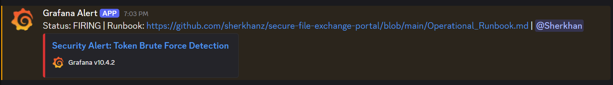

# Simulated Incident: IDOR Token Brute-Force Attack

## 1. Demo Videos

### Attack Simulation
[](https://www.youtube.com/watch?v=dxSZ-suSpBw)

### Defensive Response  
[](https://www.youtube.com/watch?v=c7CGrKayAS4)

---

## 2. Incident Summary

| Field | Detail |
|-------|--------|
| **Attack Vector** | Unauthenticated `GET /download/{token}` endpoint (IDOR) |
| **Tool Used** | `ffuf` - fast web fuzzer for token enumeration |
| **Attacker IP** | `172.22.0.1` |
| **Files Compromised** | 3 |
| **Detection Method** | Grafana alert → Discord `🚨-security-alerts` channel |

---

## 3. Attack Simulation

The attacker used **`ffuf`** to brute-force download tokens against the `GET /download/{token}` endpoint. Because the endpoint requires no authentication, any valid token discovered through enumeration grants immediate file access without credentials.

**`ffuf` command used:**
```bash
ffuf -u http://localhost:8000/download/FUZZ \
     -w /home/kali/sfep-demo/uuid_wordlist.txt \
     -mc 200 \
     -v \
     -t 10
```

The wordlist contained 500 randomly generated UUIDs with the target tokens embedded. `ffuf` identified valid tokens by matching HTTP `200` responses.

### Compromised Files

| File | Sensitivity | Impact |
|------|-------------|--------|
| `team_meeting_notes.txt` | Internal | Internal meeting notes exposed |
| `quarterly_stats.txt` | Confidential | Company financial data exposed |
| `server_credentials.txt` | Critical | Internal database credentials exposed |

The exposure of `server_credentials.txt` represents the most severe outcome - leaked database credentials enable lateral movement and further system compromise.

---

## 4. Incident Detection

### 4.1 Automated Alert

The Grafana **Failed Downloads** alert rule fired after detecting more than 10 failed download attempts within a 5-minute window. The alert was delivered in real time to the Discord channel `🚨-security-alerts`:



### 4.2 OE Dashboard Analysis

The on-call engineer confirmed the incident using the Grafana OE Dashboard:

- **Failed Downloads** panel - spike to 505 failed attempts within minutes
- **Successful Downloads** panel - 3 successful downloads confirmed on tokens not initiated by legitimate users

### 4.3 Log Analysis

Docker log analysis identified the attacker IP and confirmed compromised tokens:

```bash
sudo cat $(docker inspect --format='{{.LogPath}}' sfep_api) | grep -E "failed_download|404"
sudo cat $(docker inspect --format='{{.LogPath}}' sfep_api) | grep -E "successful_download|200"
```

**Findings:**
- **Attacker IP:** `172.22.0.1`
- **Failed attempts:** 505
- **Compromised tokens:** 3 valid tokens discovered via enumeration

---

## 5. Incident Response

All response actions were executed per **Operational_Runbook.md - Incident 1**.

### 5.1 Revoke Compromised Tokens

All three compromised tokens were immediately revoked to cut off attacker access:

```bash
curl -s -X POST http://localhost:8000/revoke/TOKEN \
  -H "x-api-token: supersecret-mock-token" | python3 -m json.tool
```

### 5.2 Block Attacker IP

The attacker IP was added to the application-level blacklist using the IP Blacklist feature:

```bash
curl -s -X POST http://localhost:8000/block/172.22.0.1 \
  -H "x-api-token: supersecret-mock-token"
```

### 5.3 Confirm Blacklist

```bash
curl -s http://localhost:8000/blocked \
  -H "x-api-token: supersecret-mock-token" | python3 -m json.tool
```

**Result:**
```json
{
    "blocked_ips": ["172.22.0.1"]
}
```

---

## 6. Recovery and Verification

### 6.1 Verify Revoked Tokens Return 410

```bash
curl -s -o /dev/null -w "HTTP Status: %{http_code}\n" \
  http://localhost:8000/download/TOKEN
```

**Result:** `HTTP Status: 410` - access denied for all three compromised tokens.

### 6.2 Verify Blocked IP Returns 403

```bash
curl -si http://localhost:8000/download/TOKEN
```

**Result:** `HTTP/1.1 403 Forbidden` - attacker IP blocked at application level.

### 6.3 Confirm Service Health

```bash
curl -s http://localhost:8000/health
```

**Result:** `{"status": "ok", "version": "0.1.0"}` — service fully operational.

---

## 7. Root Cause and Remediation

| Root Cause | Status |
|------------|--------|
| `GET /download/{token}` required no authentication | **Remediated** - `Depends(require_auth)` added post-incident |

**Post-incident remediation applied:**
- All compromised tokens revoked
- Attacker IP blocked via application-level blacklist
- `Depends(require_auth)` added to `/download/{token}` endpoint
- `slowapi` rate limiting implemented at 5 req/min per IP
